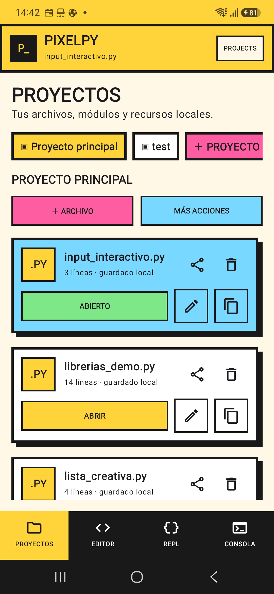
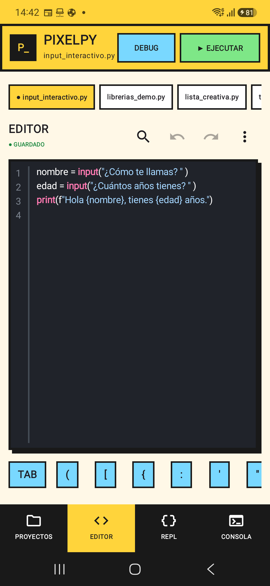
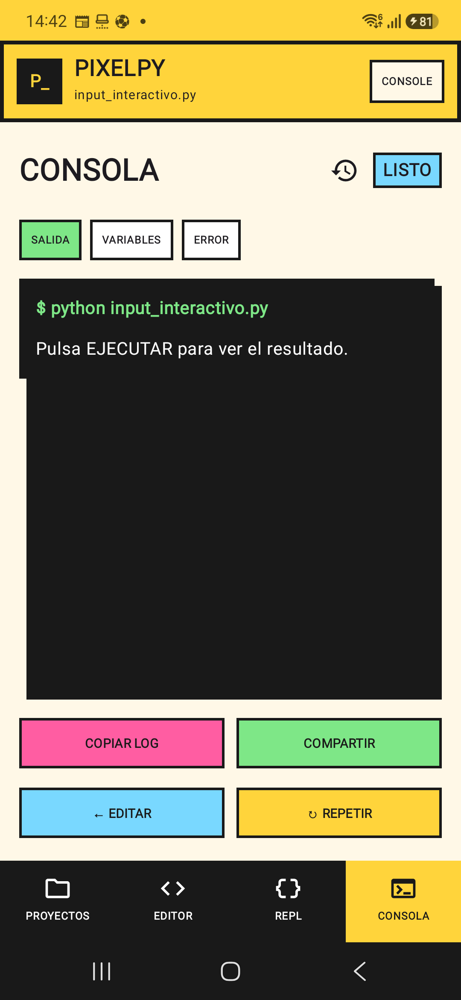

# PixelPy

Editor y entorno de ejecución de Python para Android, diseñado para trabajar directamente desde el teléfono y guardar todo localmente.

## Funciones

- Editor multifichero con resaltado, búsqueda, autocompletado y versiones.
- Proyectos con scripts y recursos CSV, JSON, Excel, imágenes, TXT y ZIP.
- Ejecución local con `input()`, detención, análisis previo y depuración de variables.
- Consola separada en salida, variables y errores.
- REPL persistente por proyecto.
- Importación y exportación de proyectos ZIP.
- Incluye `requests`, `beautifulsoup4`, `openpyxl` y `defusedxml`.
- Autosave seguro con recuperación de proyecto, archivo, pestaña y cursor.
- Interfaz neobrutalista optimizada para teclado móvil.

## Capturas

<p align="center">
  
  
  
</p>

## Requisitos

- Android 8.0 o superior.
- Dispositivo ARM64.
- Android Studio con JDK 17.
- Python 3.13 instalado en el equipo de compilación para Chaquopy.

## Compilar

```powershell
.\gradlew.bat :pyeditor:assembleDebug
```

El APK se genera en `pyeditor/build/outputs/apk/development/debug/`.

## Versión

La primera versión estable es `1.0.0`.

## Privacidad

Los proyectos se guardan localmente. PixelPy solo usa Internet cuando un script del usuario realiza una solicitud de red.
