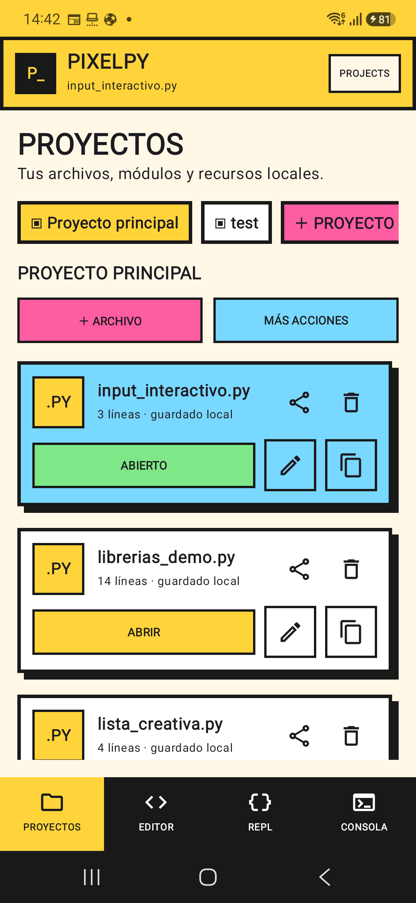
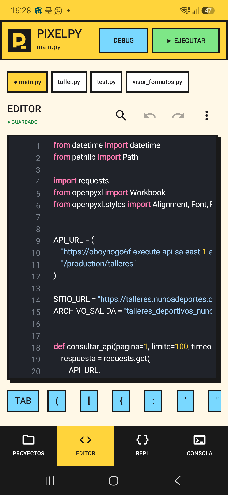
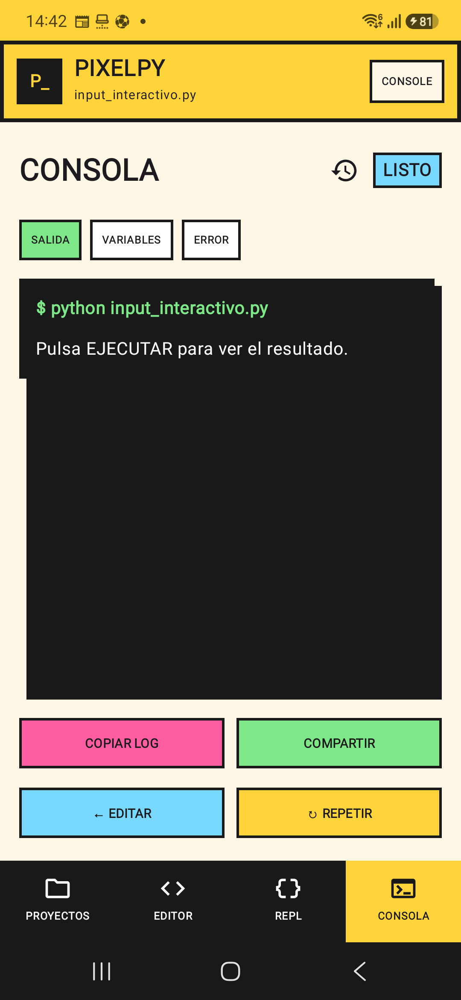
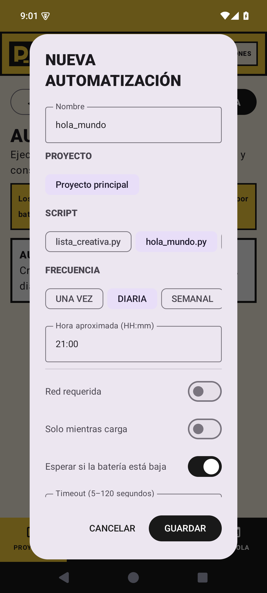
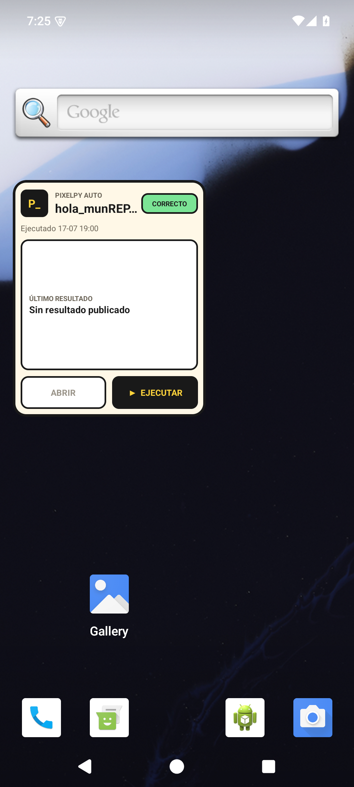
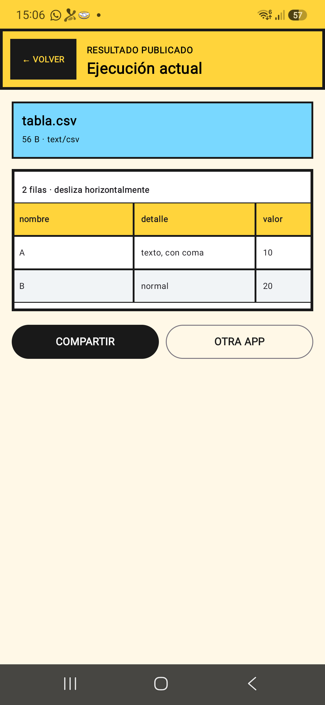
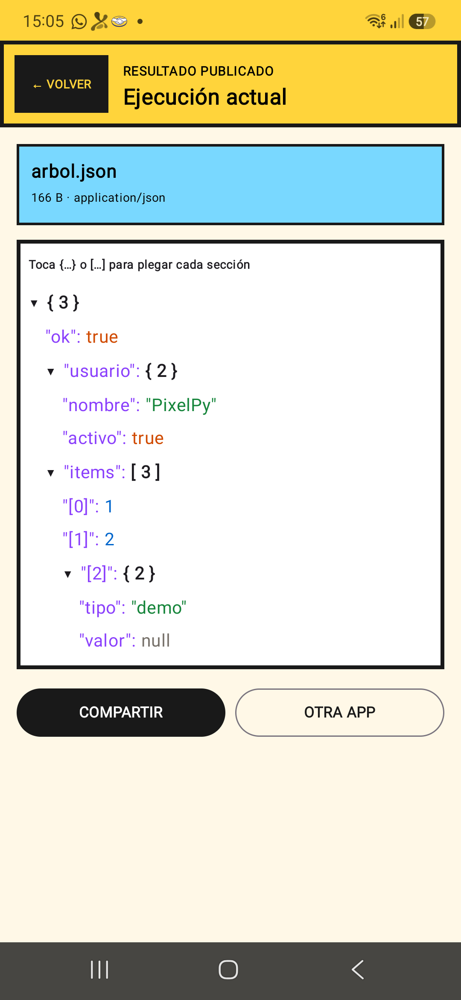
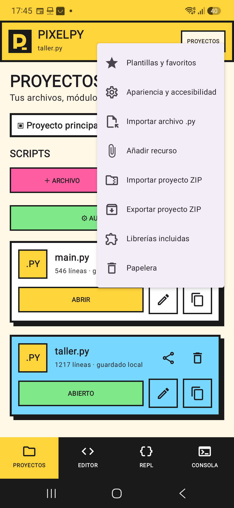

# PixelPy

Editor y entorno de ejecución de Python para Android, diseñado para trabajar directamente desde el teléfono y guardar todo localmente.

## Funciones

- Editor multifichero con resaltado, búsqueda, autocompletado y versiones.
- Proyectos con scripts y recursos CSV, JSON, Excel, imágenes, TXT y ZIP.
- Ejecución local con `input()`, detención, análisis previo y depuración de variables.
- Consola separada en salida, variables y errores.
- REPL persistente por proyecto.
- Importación y exportación de proyectos ZIP.
- Incluye `requests`, `beautifulsoup4`, `openpyxl` y `defusedxml`.
- Autosave seguro con recuperación de proyecto, archivo, pestaña y cursor.
- Automatizaciones únicas, diarias o semanales mediante WorkManager, con restricciones de red, carga y batería.
- Publicación segura de resultados y widget para consultar el estado, ejecutar el script y ver el último archivo generado.
- Visor integrado con búsqueda para texto, Markdown renderizado, JSON plegable, CSV en tabla, zoom de imágenes, explorador ZIP y vista básica de la primera hoja de Excel.
- Los archivos generados por una ejecución normal aparecen en una galería horizontal y pueden abrirse en el mismo visor directamente desde la consola.
- Historial persistente de ejecuciones con código, salida y copias de resultados; permite fijar, comparar, borrar y exportar una sesión completa como ZIP.
- Parámetros guardados por automatización (`CLAVE=valor`) y notificaciones de finalización con acceso directo al resultado.
- Parámetros visuales tipados (texto, número, sí/no y secreto), además de repetición manual con valores temporales.
- Historial detallado con código, salida, duración, archivos y diferencias reales línea por línea.
- Plantillas favoritas para APIs, CSV, Excel, gráficos, scraping y automatizaciones.
- Gestor de recursos con carpetas visibles aunque estén vacías, importación al destino elegido, selección múltiple, movimiento y renombrado seguros, rutas relativas copiables, papelera y vista previa.
- Al mover o renombrar un resultado destacado, PixelPy actualiza automáticamente la automatización que lo utiliza.
- Tema oscuro, contraste alto y tres densidades de interfaz.
- Diagnóstico de automatizaciones con historial local, causa visible en el widget, reintento y copia del reporte.
- Interfaz neobrutalista optimizada para teclado móvil.

## Capturas

<p align="center">
  
  
  
</p>

<p align="center">
  
  
</p>

<p align="center">
  
  
</p>

<p align="center">
  
</p>

## Resultados publicados

El botón **VER RESULTADO** del widget, **ABRIR RESULTADO** en automatizaciones y **VER RESULTADO** en la consola llevan al mismo visor:

- TXT, LOG y XML se muestran como texto con búsqueda.
- Markdown presenta títulos, listas, citas y bloques con jerarquía visual.
- JSON se presenta como un árbol interactivo con objetos y listas plegables.
- CSV se muestra como tabla filtrable con encabezados, filas alternadas y desplazamiento horizontal.
- PNG, JPG, JPEG y WebP permiten zoom táctil dentro de PixelPy.
- ZIP muestra su contenido sin extraerlo y XLSX ofrece una vista básica de la primera hoja.
- PDF y formatos desconocidos ofrecen **OTRA APP**.
- Todos los formatos pueden compartirse desde el visor.

La vista previa textual está limitada a 1 MB para evitar bloqueos. El visor siempre usa la copia publicada en el almacenamiento privado de PixelPy, no el archivo que el script podría estar modificando.

En la consola normal se abre el archivo generado dentro del proyecto. En automatizaciones y widgets se abre una copia publicada estable.

Consulta el flujo completo y la resolución de problemas en [Resultados publicados y widget](docs/resultados-publicados.md).

## Requisitos

- Android 8.0 o superior.
- Dispositivo ARM64.
- Android Studio con JDK 17.
- Python 3.13 instalado en el equipo de compilación para Chaquopy.

## Compilar

```powershell
.\gradlew.bat :pyeditor:assembleDebug
```

El APK se genera en `pyeditor/build/outputs/apk/development/debug/`.

## Versión

La próxima versión es `1.4.0`. Completa la fase premium previa al modo Notebook con parámetros visuales, historial detallado, Excel con varias hojas, Plotly, plantillas, consola filtrable, gestión de recursos y accesibilidad.

Las ejecuciones programadas son aproximadas: Android puede retrasarlas por batería, Doze o restricciones del sistema.

Los parámetros guardados se exponen durante la ejecución como variables de entorno. Por ejemplo, `CIUDAD=Santiago` se consulta en Python con `os.getenv("CIUDAD")`; PixelPy restaura el entorno al terminar.

## Privacidad

Los proyectos, automatizaciones y resultados publicados se guardan localmente. PixelPy solo usa Internet cuando un script del usuario realiza una solicitud de red.
