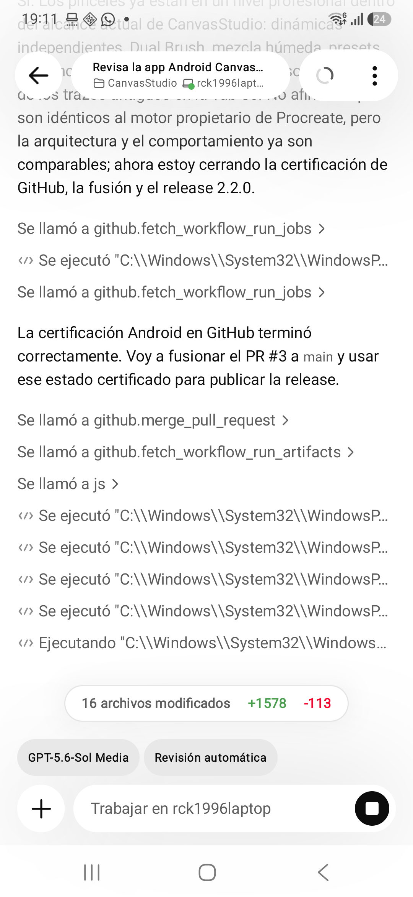

# Notebook local de PixelPy

Notebook permite combinar explicación y análisis Python dentro de un proyecto, sin servidores ni conexión obligatoria. Cada proyecto mantiene sus propios notebooks y PixelPy guarda los cambios automáticamente en su almacenamiento privado.



## Flujo básico

1. Abre **Proyectos** y pulsa **NOTEBOOK**.
2. Elige un notebook existente o crea uno desde el selector superior.
3. Añade una celda de **CÓDIGO** o **MARKDOWN**.
4. Usa **CELDA** para ejecutar hasta esa celda o **TODO** para reconstruir el análisis completo.
5. Consulta debajo de cada celda Python su salida, estado y duración.

Las celdas pueden subirse, bajarse, eliminarse o cambiarse entre Python y Markdown. El primer notebook incluye un ejemplo pequeño listo para ejecutar.

## Estado compartido y ejecución reproducible

Las celdas Python se evalúan desde arriba hasta la celda elegida dentro de un espacio de variables nuevo. Por eso una variable creada en una celda anterior puede utilizarse después:

```python
# Celda 1
ventas = [12, 18, 25, 31]
```

```python
# Celda 2
print("Promedio:", sum(ventas) / len(ventas))
```

Al volver a ejecutar una celda, PixelPy reconstruye primero las celdas Python anteriores. Esto evita depender de un estado oculto diferente del código visible. **TODO** conserva una salida independiente para cada celda y se detiene al encontrar el primer error.

Notebook utiliza el mismo coordinador de Python que Editor, DEBUG, REPL y Automatizaciones. Nunca se ejecutan dos scripts Python simultáneamente.

## Markdown

Las celdas Markdown tienen dos modos:

- **VISTA:** muestra el documento renderizado.
- **EDITAR:** permite modificar el texto original.

La vista admite:

- títulos `#` a `######`;
- párrafos;
- listas con viñetas y numeradas;
- citas con `>`;
- bloques delimitados por tres acentos graves;
- negrita `**texto**`;
- cursiva `*texto*`;
- código en línea con acentos graves.

Cambiar entre Vista y Editar no altera el Markdown guardado.

## Archivos y resultados

El código se ejecuta en la carpeta del proyecto activo. Los archivos creados o modificados aparecen después en **Recursos**, desde donde pueden previsualizarse, organizarse o compartirse.

Notebook no copia resultados a la zona publicada de las automatizaciones. Esa copia estable sigue reservada para automatizaciones y widgets.

## Límites actuales del MVP

- `input()` no abre diálogos dentro de Notebook y produce un error claro en la celda que lo solicita.
- Una ejecución completa tiene un límite máximo de 120 segundos.
- Todavía no se exporta al formato Jupyter `.ipynb`.
- Los gráficos y archivos se abren mediante el visor de resultados existente; aún no se incrustan como salida rica dentro de la celda.
- Notebook es local: no incluye colaboración, sincronización ni ejecución en servidores.

## Persistencia y privacidad

PixelPy guarda el documento de forma atómica dentro del proyecto privado. El notebook incluye sus celdas, Markdown, salida, estado y duración. No se envía contenido a Internet salvo que el propio código Python realice una solicitud de red.
